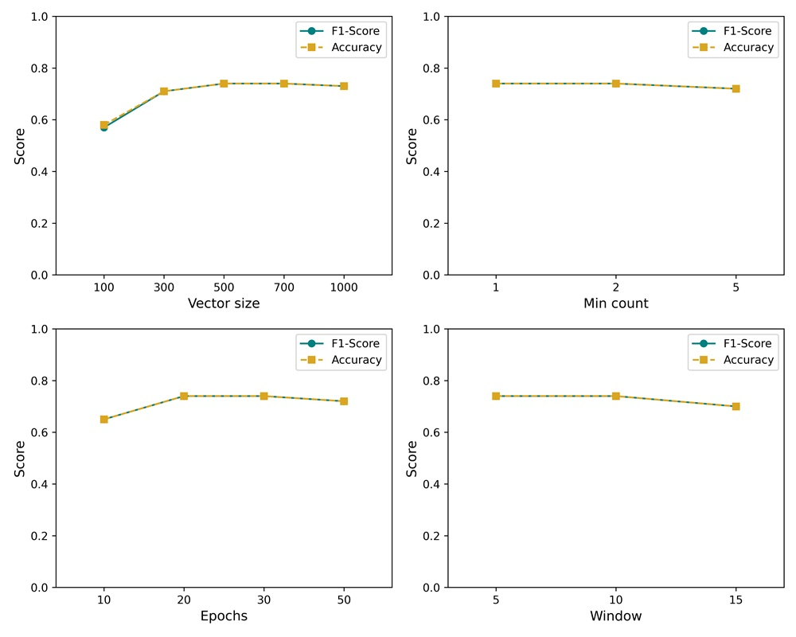
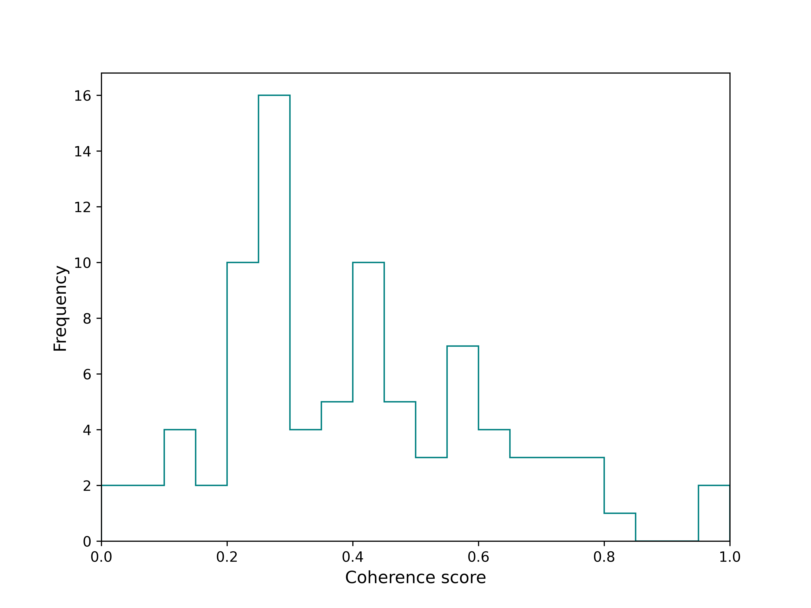
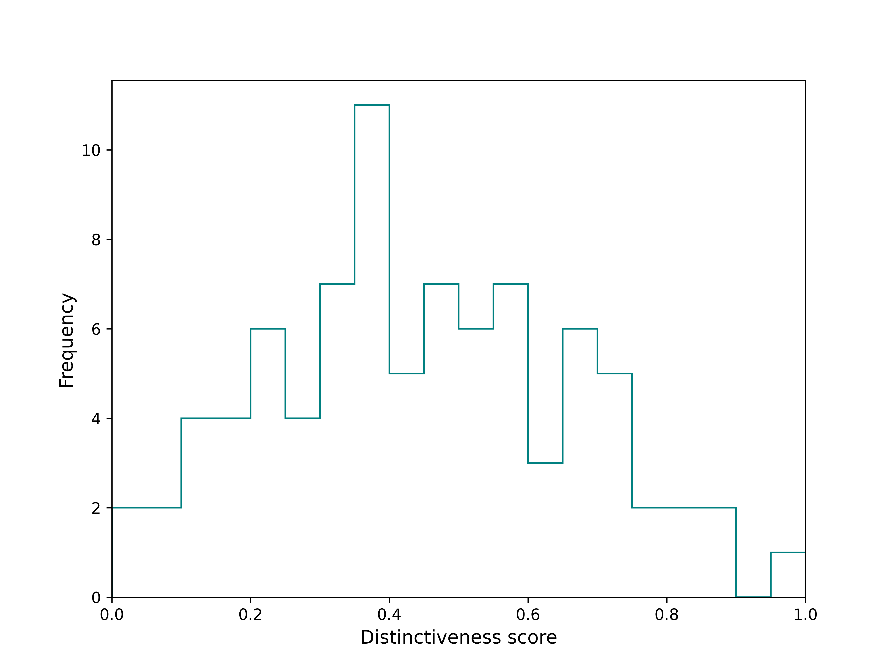

# Coherence modeling

### Objective

The key goal of this pipeline is to **quantify category coherence** in crowdfunding campaign descriptions using text embeddings. Specifically, the workflow:

- Preprocesses campaign text data by tokenization, stopword removal, and lemmatization.
- Trains a **Doc2Vec** model to generate dense vector representations of campaign descriptions.
- Uses **cosine similarity** within each category to measure how coherent that category is semantically.
  
### Role of Logistic Regression Model

The **Logistic Regression classifier** serves as an **evaluation tool** to **tune the hyperparameters** of the Doc2Vec model. Since the ultimate goal is to produce document embeddings that capture meaningful category distinctions:

- The LR model is trained on Doc2Vec-generated vectors to classify campaigns into their respective categories.
- By testing different Doc2Vec hyperparameter settings (e.g., vector size, window size, epochs), we observe the classification performance of LR.
- The hyperparameter configuration yielding the highest LR accuracy is chosen as the best Doc2Vec model setup.

This approach treats the LR classification accuracy as a **proxy metric** for the quality of the embeddings in representing category coherence.

### Results Summary

- The best performing Doc2Vec model achieved an LR classification **accuracy of approximately 74%** on the balanced dataset.
- Detailed classification reports and confusion matrices are generated to evaluate category-wise performance.
- Category coherence scores are computed via average pairwise cosine similarity of document vectors within each category.
 

### Visualizations

- **Hyperparameter Tuning Plot**  
  

  
  

  
  

  
  

  
  </p
  *Normalized distribution of novelty scores across all campaigns.*

